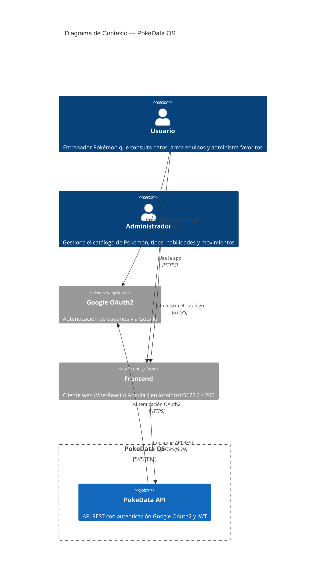
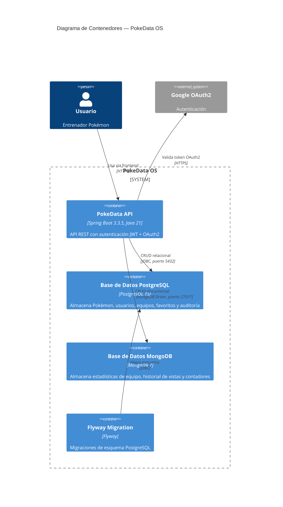
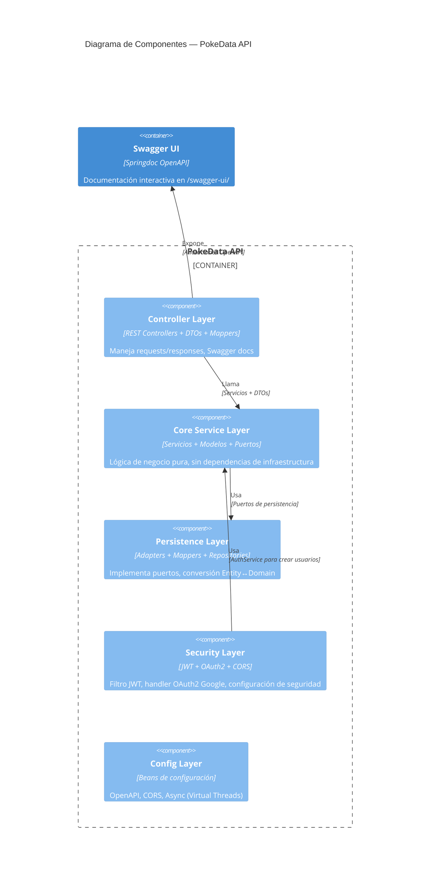
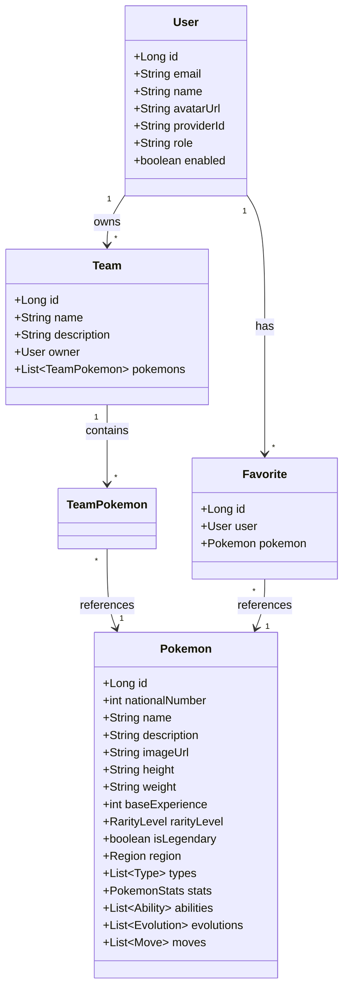
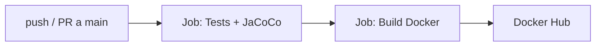

# PokeData OS — Pokédex REST API

API REST de Pokédex con autenticación Google OAuth2, arquitectura limpia por capas y doble persistencia (PostgreSQL + MongoDB). Construida con Java 21, Spring Boot 3.3.5 y despliegue basado en Docker Compose.

---

## Arquitectura — Clean Architecture (5 Capas)

```
┌─────────────────────────────────────────────────┐
│                  CONTROLLER                      │
│  (DTOs, Swagger, ExceptionHandler, Mappers)      │
├─────────────────────────────────────────────────┤
│                    CORE                          │
│  (Modelos, Puertos, Interfaces de Servicio)      │
├─────────────────────────────────────────────────┤
│                 PERSISTENCE                      │
│  (JPA Entities, MongoDB Documents, Repos,        │
│   Adapters, Mappers Entity↔Domain)               │
├─────────────────────────────────────────────────┤
│              CONFIG + SECURITY                   │
│  (JWT, OAuth2, CORS, OpenAPI, Async)             │
├─────────────────────────────────────────────────┤
│              INFRASTRUCTURE                      │
│  (Docker, Flyway, Spring Boot)                   │
└─────────────────────────────────────────────────┘
```

Cada capa se comunica con la siguiente a través de **puertos** (interfaces), garantizando bajo acoplamiento y alta testabilidad.

---

## Diagramas C4

### C1 — Contexto del Sistema



### C2 — Contenedores



### C3 — Componentes (Spring Boot)



### C4 — Entidades y Relaciones



---

## Stack Tecnológico

| Categoría          | Tecnología                          | Versión  |
| ------------------ | ----------------------------------- | -------- |
| Lenguaje           | Java (Temurin)                      | 21       |
| Framework          | Spring Boot                         | 3.3.5    |
| ORM                | Spring Data JPA / Hibernate         | —        |
| Documental         | Spring Data MongoDB                 | —        |
| Migraciones        | Flyway                              | —        |
| Auth               | Spring Security + OAuth2 Client     | —        |
| JWT                | JJWT (io.jsonwebtoken)              | 0.12.6   |
| Mapping            | MapStruct                           | 1.5.5    |
| OpenAPI            | Springdoc                           | 2.6.0    |
| Testing            | JUnit 5 + Mockito + SpringBootTest  | —        |
| Cobertura          | JaCoCo                              | 0.8.12   |
| Base de Datos (1)  | PostgreSQL                          | 15       |
| Base de Datos (2)  | MongoDB                             | 7        |
| Container Runtime  | Docker Compose                      | 3.8      |

---

## Prerrequisitos

- **JDK 21** (Temurin recomendado)
- **Docker Desktop** (para PostgreSQL + MongoDB)
- Variables de entorno para Google OAuth2:

```bash
# Windows (PowerShell)
$env:GOOGLE_CLIENT_ID = "tu-client-id"
$env:GOOGLE_CLIENT_SECRET = "tu-client-secret"
$env:JWT_SECRET = "base64-de-256-bits"

# Linux/macOS
export GOOGLE_CLIENT_ID="tu-client-id"
export GOOGLE_CLIENT_SECRET="tu-client-secret"
export JWT_SECRET="base64-de-256-bits"
```

---

## Getting Started

```bash
# 1. Clonar el repositorio
git clone <repo-url> PokeDataOS
cd PokeDataOS/Pokedex

# 2. Iniciar bases de datos
docker compose up -d

# 3. Compilar y empaquetar
./mvnw clean compile

# 4. Ejecutar tests
./mvnw test

# 5. Verificar cobertura (JaCoCo)
./mvnw verify

# 6. Ejecutar la aplicación
./mvnw spring-boot:run
```

La aplicación arranca en **`http://localhost:8080/api`**.

---

## Documentación de la API (Swagger)

Con la aplicación corriendo:

| Recurso                     | URL                                              |
| --------------------------- | ------------------------------------------------ |
| Swagger UI                  | `http://localhost:8080/api/swagger-ui/`          |
| OpenAPI Spec (JSON)         | `http://localhost:8080/api/v3/api-docs`          |
| OpenAPI Spec (YAML)         | `http://localhost:8080/api/v3/api-docs.yaml`     |
| Health Check                | `http://localhost:8080/api/actuator/health`      |

---

## Endpoints Principales

| Método | Endpoint                    | Auth     | Descripción                          |
| ------ | --------------------------- | -------- | ------------------------------------ |
| GET    | `/v1/pokemon`               | Bearer   | Lista paginada de Pokémon            |
| GET    | `/v1/pokemon/{id}`          | Bearer   | Detalle de Pokémon                   |
| POST   | `/v1/pokemon`               | ADMIN    | Crear Pokémon                        |
| PUT    | `/v1/pokemon/{id}`          | ADMIN    | Actualizar Pokémon                   |
| DELETE | `/v1/pokemon/{id}`          | ADMIN    | Eliminar Pokémon                     |
| POST   | `/v1/auth/login`            | Público  | Login (reservado para futuros métodos) |
| GET    | `/v1/auth/me`               | Bearer   | Perfil del usuario autenticado        |
| GET    | `/v1/teams`                 | Bearer   | Equipos del usuario                   |
| POST   | `/v1/teams`                 | Bearer   | Crear equipo                          |
| GET    | `/v1/favorites`             | Bearer   | Favoritos del usuario                 |
| POST   | `/v1/favorites/{pokemonId}` | Bearer   | Agregar a favoritos                   |

> **Nota**: El login real es **exclusivamente via Google OAuth2**. La aplicación redirige a `/oauth2/authorization/google` y el callback crea el usuario automáticamente si es la primera vez.

---

## Testing

```bash
# Todos los tests
./mvnw test

# Tests específicos
./mvnw test -Dtest="PokemonServiceImplTest"

# Tests + cobertura
./mvnw verify
```

**Tests actuales:** 15 tests unitarios distribuidos en:

| Test Class                          | Tests | Scope                          |
| ----------------------------------- | ----- | ------------------------------ |
| `PokemonServiceImplTest`            | 7     | CRUD + filtros + paginación    |
| `AuthServiceImplTest`               | 2     | Procesamiento OAuth2 + duplicados |
| `TeamServiceImplTest`               | 3     | CRUD + validación de dueño     |
| `PokemonControllerTest`             | 2     | Controller MVC con MockMvc     |
| `PokedexApplicationTests`           | 1     | Contexto de Spring Boot        |

---

## CI/CD — Integración y Despliegue Continuo

### Pipeline (GitHub Actions)

El repositorio incluye un pipeline automatizado en `.github/workflows/ci.yml` con dos jobs:



**Job 1 — Tests y Calidad** (en cada push y PR):
- Checkout del código
- Configura JDK 21 (Temurin) con caché de Maven
- Ejecuta `mvn verify` (tests + JaCoCo coverage)
- Sube el reporte JaCoCo como artifact

**Job 2 — Build Docker** (solo en push a `main`):
- Construye la imagen multi-stage con Docker Buildx
- Pushea la imagen a Docker Hub
- Usa caché de GitHub Actions para builds rápidos

### Docker

La aplicación incluye un `Dockerfile` multi-stage:

```dockerfile
# STAGE 1: Build con Maven + JDK 21
FROM maven:3.9-eclipse-temurin-21-alpine AS build
# ... compila y empaqueta

# STAGE 2: Run con JRE 21 (usuario no-root)
FROM eclipse-temurin:21-jre-alpine
COPY --from=build /app/target/*.jar app.jar
USER pokedex
ENTRYPOINT ["java", "-jar", "app.jar"]
```

### Despliegue con Docker Compose

El `docker-compose.yml` orquesta los 3 servicios:

| Servicio   | Puerto | Depende de              |
| ---------- | ------ | ----------------------- |
| `postgres` | 5432   | —                       |
| `mongo`    | 27017  | —                       |
| `app`      | 8080   | postgres (healthy), mongo (healthy) |

```bash
# Construir y levantar todo
docker compose up --build -d

# Verificar que los 3 servicios estén corriendo
docker compose ps

# Ver logs de la API
docker compose logs -f app

# Detener todo
docker compose down
```

### Requisitos para CI/CD

1. Crear los siguientes **secrets** en GitHub → Settings → Secrets and variables → Actions:

| Secret              | Descripción                       |
| ------------------- | --------------------------------- |
| `DOCKER_USERNAME`   | Usuario de Docker Hub             |
| `DOCKER_PASSWORD`   | Token de acceso a Docker Hub      |

2. Push a `main` para activar el pipeline completo. También correrá tests en PRs.

---

## Estructura del Proyecto

```
src/
├── main/
│   ├── java/DOSW/Pokedex/
│   │   ├── config/          # Configuraciones globales (CORS, OpenAPI, Async)
│   │   ├── controller/
│   │   │   ├── api/         # Interfaces con Swagger (@SecurityRequirement, @Operation)
│   │   │   ├── dto/         # Java Records request/response
│   │   │   ├── handler/     # GlobalExceptionHandler con ApiError
│   │   │   ├── impl/        # Implementaciones de controllers
│   │   │   ├── mapper/      # Mappers DTO ↔ Domain (MapStruct)
│   │   │   └── swagger/     # OpenApiConfig (Bearer JWT Scheme)
│   │   ├── core/
│   │   │   ├── exception/   # BusinessException, ResourceNotFoundException, etc.
│   │   │   ├── model/       # @Value + @Builder domain models
│   │   │   ├── service/
│   │   │   │   ├── impl/    # Implementaciones de servicios
│   │   │   │   └── interfaces/  # Servicios y puertos de persistencia
│   │   │   ├── util/        # Utilidades (si aplica)
│   │   │   └── validator/   # Validadores de negocio
│   │   ├── persistence/
│   │   │   ├── adapter/     # Implementación de puertos (JPA + MongoDB)
│   │   │   ├── entity/
│   │   │   │   ├── document/      # MongoDB Documents
│   │   │   │   └── relational/    # JPA Entities
│   │   │   ├── mapper/     # MapStruct Entity ↔ Domain
│   │   │   └── repository/
│   │   │       ├── document/      # MongoDB Repositories
│   │   │       └── relational/    # JPA Repositories
│   │   └── security/
│   │       ├── JwtAuthFilter      # Filtro OncePerRequestFilter
│   │       ├── JwtService         # Generación/validación HMAC-SHA
│   │       ├── OAuth2SuccessHandler # Callback Google → JWT → frontend
│   │       ├── SecurityConfig     # SecurityFilterChain, CORS
│   │       └── UserDetailsServiceImpl  # UserDetailsService via puerto
│   └── resources/
│       ├── db/migration/          # Flyway migrations (V1__init_schema.sql)
│       ├── application.yml        # Config principal
│       └── application-test.yml   # Perfil de tests (H2)
└── test/
    └── java/DOSW/Pokedex/
        ├── controller/impl/       # @WebMvcTest
        ├── core/service/impl/     # Unit tests con mocks
        └── PokedexApplicationTests  # @SpringBootTest
```

---

## Decisiones Técnicas

| Decisión                     | Justificación                                                                 |
| ---------------------------- | ----------------------------------------------------------------------------- |
| **Google-only Auth**         | Sin registro por email. Usuario se crea en primer login Google (RF-001/002).  |
| **JWT stateless**            | Sin sesiones HTTP. Token JWT en header `Authorization: Bearer <token>`.       |
| **PostgreSQL + MongoDB**     | Datos relacionales (Pokémon, usuarios) en SQL; estadísticas y vistas en NoSQL. |
| **Virtual Threads**          | `executor.setVirtualThreads(true)` para operaciones I/O (Java 21).            |
| **MapStruct**                | Conversión Entity↔Domain y Domain↔DTO sin boilerplate.                        |
| **Flyway**                   | Migraciones de esquema versionadas y repetibles.                              |
| **Springdoc OpenAPI**        | Documentación interactiva con soporte Bearer JWT.                             |

---

## Licencia

Proyecto académico — DOSW 2026.
