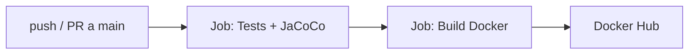

# PokeData OS — Pokédex REST API

API REST de Pokédex con autenticación Google OAuth2, arquitectura MVC y doble persistencia (PostgreSQL + MongoDB). Construida con Java 21, Spring Boot 3.3.5 y despliegue basado en Docker Compose.

---

## Brand Identity

```
⚡ PokeData OS — Donde los datos encuentran su forma
```

| Atributo | Descripción |
|---|---|
| **Estética** | Dark Mode | Cyberpunk limpio | Glassmorphism |
| **Mascota** | Rotom (Forma Pokédex) — Eléctrico/Fantasma |
| **Colores** | ⚫ Black Cyber `#121214` · 🔴 Red Rotom `#FF3E3E` · 🔵 Azul Eléctrico `#00E5FF` |
| **Tipografía** | Orbitron (títulos) · Inter (cuerpo) · JetBrains Mono (código) |
| **Logo** | "PokeData OS" con Pokéball digital reemplazando la "O" |

📖 Manual completo en [`IDENTITY_MANUAL.md`](IDENTITY_MANUAL.md).

---

## Arquitectura — MVC (Modelo-Vista-Controlador)

Arquitectura MVC estricta donde los Controladores manejan requests/responses, los Servicios contienen la lógica de negocio, y los Repositorios gestionan la persistencia. Sin capas de abstracción adicionales (sin puertos, sin adapters).

```
┌─────────────────────────────────────────────────┐
│               CONTROLLER LAYER                   │
│  @RestController + DTOs + Mappers + Handler      │
│  (Auth, Pokemon, Favorite, Team Controllers)      │
├─────────────────────────────────────────────────┤
│               SERVICE LAYER                       │
│  @Service + Modelos de dominio                    │
│  (Auth, Pokemon, Favorite, Team Services)         │
├─────────────────────────────────────────────────┤
│              REPOSITORY LAYER                     │
│  JPA Repositories + Mongo Repositories            │
│  (13 repos: PostgreSQL + MongoDB)                 │
├─────────────────────────────────────────────────┤
│              SECURITY LAYER                       │
│  JwtAuthFilter + OAuth2 + SecurityConfig + CORS   │
├─────────────────────────────────────────────────┤
│              INFRASTRUCTURE                       │
│  Docker Compose + Flyway + Spring Boot + OpenAPI  │
└─────────────────────────────────────────────────┘
```

Flujo de datos: `Controller → Service → Repository`

Sin puertos, sin interfaces de servicio, sin capa de dominio separada. Los servicios inyectan repositorios directamente. MVC puro como exige el estándar del curso.

---

## Diagramas (5 diagramas en draw.io)

Los diagramas del proyecto fueron realizados con **draw.io** (formato `.drawio`) y se encuentran en el directorio [`diagrams/`](diagrams/).

---

### 4.1 C1 — Diagrama de Contexto (Nivel 1)

Muestra el sistema como una **caja negra** con sus actores e integraciones externas.

**Archivo:** [`diagrams/c1-context.drawio`](diagrams/c1-context.drawio)

```
┌─────────────────────────────────────────────────────────────┐
│  Personas:    Usuario (Entrenador)    Administrador          │
│                                                             │
│  Sistema:     PokeData API (Spring Boot, JWT, OAuth2)       │
│                                                             │
│  Externos:    Google OAuth2  ·  Prototipo Figma (ref.)      │
└─────────────────────────────────────────────────────────────┘
```

**Actores:**

| Actor | Descripción |
|---|---|
| **Usuario** | Entrenador Pokémon que consulta datos, arma equipos y administra favoritos |
| **Administrador** | Gestiona el catálogo de Pokémon, tipos, habilidades y movimientos |

**Sistema principal:** PokeData API — API REST con autenticación Google OAuth2 y JWT, arquitectura MVC, doble persistencia (PostgreSQL + MongoDB).

**Integraciones externas:**
- **Google OAuth2** — Autenticación de usuarios via Google
- **Prototipo Figma** — Referencia visual (no conectado al backend)

**Flujo:** Usuario/Admin → se autentican via Google OAuth2 → consumen la API REST → la API valida el token JWT y responde.

---

### 4.2 C2 — Diagrama de Componentes General (Nivel 2)

Muestra las **5 capas internas** del sistema y sus responsabilidades principales.

**Archivo:** [`diagrams/c2-components.drawio`](diagrams/c2-components.drawio)


| Capa | Color | Componentes | Responsabilidad |
|---|---|---|---|
| **1. Controller** | 🔴 Red Rotom | AuthController, PokemonController, FavoriteController, TeamController | Gestiona requests HTTP, validación de entrada, Swagger docs |
| **2. Service** | 🔵 Azul Eléctrico | AuthService, PokemonService, FavoriteService, TeamService | Lógica de negocio, reglas de dominio, coordinación |
| **3. Repository** | 🟢 Verde | 10 JPA Repositories + 3 Mongo Repositories | Persistencia directa, sin adapters ni puertos |
| **4. Security** | 🟣 Púrpura | JwtAuthFilter, JwtService, OAuth2SuccessHandler, SecurityConfig | Autenticación JWT + OAuth2, CORS |
| **5. Infrastructure** | 🟠 Naranja | Docker Compose, Flyway, Springdoc, Actuator | Configuración, despliegue, documentación |

**Flujo de datos entre capas:**
```
Controller → Service → Repository → Base de Datos
     ←          ←          ←
```

---

### 4.3 C3 — Diagrama de Componentes Específico (Flujo Pokémon)

Muestra el flujo completo de una petición `GET /api/v1/pokemon/{id}` a través de todas las capas.

**Archivo:** [`diagrams/c3-pokemon-flow.drawio`](diagrams/c3-pokemon-flow.drawio)


**Pasos del flujo:**

| Paso | Capa | Acción |
|---|---|---|
| **1** | Cliente | `GET /api/v1/pokemon/25` con `Authorization: Bearer <JWT>` |
| **2** | Security (JwtAuthFilter) | Valida token JWT, extrae usuario, setea SecurityContext |
| **3** | Controller (PokemonController) | Recibe request, llama a `pokemonService.findById(25L)` |
| **4** | Service (PokemonService) | Llama a `pokemonRepository.findById(25L)` |
| **5** | Repository (PokemonRepository) | Genera SQL con JOINs a tablas relacionadas |
| **6** | PostgreSQL | Ejecuta query, retorna `PokemonEntity` con datos completos |
| **7** | Service → Mapper | Mapea `Entity → DTO` via MapStruct (`PokemonMapper`) |
| **8** | Controller | Envuelve DTO en `ResponseEntity<PokemonResponseDTO>` |
| **9** | Cliente | Recibe `HTTP 200 OK` con JSON del Pokémon |

**Ejemplo de respuesta:**
```json
{
  "id": 25,
  "nationalNumber": 25,
  "name": "Pikachu",
  "types": [{ "name": "Eléctrico" }],
  "stats": { "hp": 35, "attack": 55, "speed": 90 },
  "abilities": ["Static", "Lightning Rod"],
  "evolutions": [
    { "evolvesFrom": 172, "evolvesTo": 25, "trigger": "level-up", "minLevel": 1 }
  ]
}
```

---

### 4.4 C4 — Diagrama de Clases

Muestra las **clases principales (entidades JPA)**, sus atributos y relaciones. Foco en los objetos de la capa Modelo.

**Archivo:** [`diagrams/c4-classes.drawio`](diagrams/c4-classes.drawio)


**Entidades principales:**

| Entidad | Tabla | Descripción |
|---|---|---|
| `PokemonEntity` | `pokemon` | Catálogo de Pokémon con datos base, tipos, estadísticas, evoluciones |
| `PokemonStatsEntity` | `pokemon_stats` | Estadísticas base (HP, Attack, Defense, Sp.Atk, Sp.Def, Speed) — OneToOne con Pokémon |
| `RegionEntity` | `region` | Regiones (Kanto, Johto, etc.) — ManyToOne desde Pokémon |
| `TypeEntity` | `type` | Tipos Pokémon (Eléctrico, Fuego, etc.) — ManyToMany con Pokémon via `pokemon_type` |
| `AbilityEntity` | `ability` | Habilidades — ManyToMany con Pokémon via `pokemon_ability` |
| `MoveEntity` | `move` | Movimientos — ManyToMany con Pokémon via `pokemon_move` |
| `EvolutionEntity` | `evolution` | Cadenas evolutivas — OneToMany desde Pokémon |
| `UserEntity` | `users` | Usuarios autenticados via Google OAuth2 |
| `TeamEntity` | `teams` | Equipos Pokémon del usuario |
| `TeamPokemonEntity` | `team_pokemon` | Relación N:M entre Team y Pokémon con slot position |
| `FavoriteEntity` | `favorites` | Favoritos del usuario — UniqueConstraint(user_id, pokemon_id) |
| `AuditLogEntity` | `audit_log` | Auditoría de acciones del sistema |

**Relaciones clave:**
- `PokemonEntity` 1:1 `PokemonStatsEntity`
- `PokemonEntity` N:1 `RegionEntity`
- `PokemonEntity` N:M `TypeEntity` (via `pokemon_type`)
- `PokemonEntity` N:M `AbilityEntity` (via `pokemon_ability`)
- `PokemonEntity` N:M `MoveEntity` (via `pokemon_move`)
- `PokemonEntity` 1:N `EvolutionEntity`
- `UserEntity` 1:N `TeamEntity` → 1:N `TeamPokemonEntity` → N:1 `PokemonEntity`
- `UserEntity` 1:N `FavoriteEntity` → N:1 `PokemonEntity`

---

### 4.5 C5 — Diagrama Entidad-Relación (PostgreSQL) y Documentos (MongoDB)

Dos sub-diagramas en un mismo archivo:

**Archivo:** [`diagrams/c5-er-mongodb.drawio`](diagrams/c5-er-mongodb.drawio)


**Tablas:**
| Esquema | Tablas | Propósito |
|---|---|---|
| **Catálogo** | `pokemon`, `pokemon_stats`, `region`, `type`, `ability`, `move`, `evolution` | Datos maestros de Pokémon |
| **Join** | `pokemon_type`, `pokemon_ability`, `pokemon_move` | Relaciones N:M con surrogate keys |
| **Usuarios** | `users`, `teams`, `team_pokemon`, `favorites` | Datos de usuario, equipos y favoritos |
| **Auditoría** | `audit_log` | Trazabilidad de acciones |


**Estrategia de persistencia híbrida:**
- **PostgreSQL** → Datos relacionales estructurados (Pokémon, usuarios, equipos, transacciones)
- **MongoDB** → Datos analíticos y series temporales (stats, vistas, historial)
- Los documentos MongoDB referencian IDs de las tablas SQL (no duplican datos maestros)

---

## Stack Tecnológico

| Categoría          | Tecnología                          | Versión  |
| ------------------ | ----------------------------------- | -------- |
| Lenguaje           | Java (Temurin)                      | 21       |
| Framework          | Spring Boot                         | 3.3.5    |
| ORM                | Spring Data JPA / Hibernate         | —        |
| Documental         | Spring Data MongoDB                 | —        |
| Migraciones        | Flyway                              | —        |
| Auth               | Spring Security + OAuth2 Client     | —        |
| JWT                | JJWT (io.jsonwebtoken)              | 0.12.6   |
| Mapping            | MapStruct                           | 1.5.5    |
| OpenAPI            | Springdoc                           | 2.6.0    |
| Testing            | JUnit 5 + Mockito + SpringBootTest  | —        |
| Cobertura          | JaCoCo                              | 0.8.12   |
| Base de Datos (1)  | PostgreSQL                          | 15       |
| Base de Datos (2)  | MongoDB                             | 7        |
| Container Runtime  | Docker Compose                      | 3.8      |

---

## Prerrequisitos

- **JDK 21** (Temurin recomendado)
- **Docker Desktop** (para PostgreSQL + MongoDB)
- Variables de entorno para Google OAuth2:

```bash
# Windows (PowerShell)
$env:GOOGLE_CLIENT_ID = "tu-client-id"
$env:GOOGLE_CLIENT_SECRET = "tu-client-secret"
$env:JWT_SECRET = "base64-de-256-bits"

# Linux/macOS
export GOOGLE_CLIENT_ID="tu-client-id"
export GOOGLE_CLIENT_SECRET="tu-client-secret"
export JWT_SECRET="base64-de-256-bits"
```

---

## Getting Started

```bash
# 1. Clonar el repositorio
git clone <repo-url> PokeDataOS
cd PokeDataOS/Pokedex

# 2. Iniciar bases de datos
docker compose up -d

# 3. Compilar y empaquetar
./mvnw clean compile

# 4. Ejecutar tests
./mvnw test

# 5. Verificar cobertura (JaCoCo)
./mvnw verify

# 6. Ejecutar la aplicación
./mvnw spring-boot:run
```

La aplicación arranca en **`http://localhost:8080/api`**.

---

## Documentación de la API (Swagger)

Con la aplicación corriendo:

| Recurso                     | URL                                              |
| --------------------------- | ------------------------------------------------ |
| Swagger UI                  | `http://localhost:8080/api/swagger-ui/`          |
| OpenAPI Spec (JSON)         | `http://localhost:8080/api/v3/api-docs`          |
| OpenAPI Spec (YAML)         | `http://localhost:8080/api/v3/api-docs.yaml`     |
| Health Check                | `http://localhost:8080/api/actuator/health`      |

---

## Endpoints Principales

| Método | Endpoint                    | Auth     | Descripción                          |
| ------ | --------------------------- | -------- | ------------------------------------ |
| GET    | `/v1/pokemon`               | Bearer   | Lista paginada de Pokémon            |
| GET    | `/v1/pokemon/{id}`          | Bearer   | Detalle de Pokémon                   |
| POST   | `/v1/pokemon`               | ADMIN    | Crear Pokémon                        |
| PUT    | `/v1/pokemon/{id}`          | ADMIN    | Actualizar Pokémon                   |
| DELETE | `/v1/pokemon/{id}`          | ADMIN    | Eliminar Pokémon                     |
| POST   | `/v1/auth/login`            | Público  | Login (reservado para futuros métodos) |
| GET    | `/v1/auth/me`               | Bearer   | Perfil del usuario autenticado        |
| GET    | `/v1/teams`                 | Bearer   | Equipos del usuario                   |
| POST   | `/v1/teams`                 | Bearer   | Crear equipo                          |
| GET    | `/v1/favorites`             | Bearer   | Favoritos del usuario                 |
| POST   | `/v1/favorites/{pokemonId}` | Bearer   | Agregar a favoritos                   |

> **Nota**: El login real es **exclusivamente via Google OAuth2**. La aplicación redirige a `/oauth2/authorization/google` y el callback crea el usuario automáticamente si es la primera vez.

---

## Testing

```bash
# Todos los tests
./mvnw test

# Tests específicos
./mvnw test -Dtest="PokemonServiceImplTest"

# Tests + cobertura
./mvnw verify
```

**Tests actuales:** 36 tests unitarios distribuidos en:

| Test Class                          | Tests | Scope                          |
| ----------------------------------- | ----- | ------------------------------ |
| `PokemonServiceImplTest`            | 7     | CRUD + filtros + paginación    |
| `AuthServiceImplTest`               | 2     | Procesamiento OAuth2 + duplicados |
| `TeamServiceImplTest`               | 3     | CRUD + validación de dueño     |
| `JwtServiceTest`                    | 6     | Generación, validación, expiración de JWT |
| `FavoriteServiceImplTest`           | 5     | CRUD favoritos + duplicados    |
| `TeamControllerTest`                | 5     | Controller MVC con MockMvc     |
| `FavoriteControllerTest`            | 3     | Controller MVC con MockMvc     |
| `AuthControllerTest`                | 2     | Controller MVC con MockMvc     |
| `PokemonControllerTest`             | 2     | Controller MVC con MockMvc     |
| `PokedexApplicationTests`           | 1     | Contexto de Spring Boot        |

**Cobertura JaCoCo:** Threshold actual 0.22 (22%).

---

## CI/CD — Integración y Despliegue Continuo

### Pipeline (GitHub Actions)

El repositorio incluye un pipeline automatizado en `.github/workflows/ci.yml` con dos jobs:



**Job 1 — Tests y Calidad** (en cada push y PR):
- Checkout del código
- Configura JDK 21 (Temurin) con caché de Maven
- Ejecuta `mvn verify` (tests + JaCoCo coverage)
- Sube el reporte JaCoCo como artifact

**Job 2 — Build Docker** (solo en push a `main`):
- Construye la imagen multi-stage con Docker Buildx
- Pushea la imagen a Docker Hub
- Usa caché de GitHub Actions para builds rápidos

### Docker

La aplicación incluye un `Dockerfile` multi-stage:

```dockerfile
# STAGE 1: Build con Maven + JDK 21
FROM maven:3.9-eclipse-temurin-21-alpine AS build
# ... compila y empaqueta

# STAGE 2: Run con JRE 21 (usuario no-root)
FROM eclipse-temurin:21-jre-alpine
COPY --from=build /app/target/*.jar app.jar
USER pokedex
ENTRYPOINT ["java", "-jar", "app.jar"]
```

### Despliegue con Docker Compose

El `docker-compose.yml` orquesta los 3 servicios:

| Servicio   | Puerto | Depende de              |
| ---------- | ------ | ----------------------- |
| `postgres` | 5432   | —                       |
| `mongo`    | 27017  | —                       |
| `app`      | 8080   | postgres (healthy), mongo (healthy) |

```bash
# Construir y levantar todo
docker compose up --build -d

# Verificar que los 3 servicios estén corriendo
docker compose ps

# Ver logs de la API
docker compose logs -f app

# Detener todo
docker compose down
```

### Requisitos para CI/CD

1. Crear los siguientes **secrets** en GitHub → Settings → Secrets and variables → Actions:

| Secret              | Descripción                       |
| ------------------- | --------------------------------- |
| `DOCKER_USERNAME`   | Usuario de Docker Hub             |
| `DOCKER_PASSWORD`   | Token de acceso a Docker Hub      |

2. Push a `main` para activar el pipeline completo. También correrá tests en PRs.

---

## Estructura del Proyecto (MVC)

```
src/
├── main/
│   ├── java/DOSW/Pokedex/
│   │   ├── config/          # Configuraciones globales (CORS, OpenAPI, Async)
│   │   ├── controller/      # @RestController (Auth, Pokemon, Favorite, Team)
│   │   ├── dto/             # Java Records request/response (14 DTOs)
│   │   ├── exception/       # BusinessException, ResourceNotFoundException
│   │   ├── handler/         # GlobalExceptionHandler con ApiError
│   │   ├── mapper/          # MapStruct DTO ↔ Entity (3 mappers)
│   │   ├── model/           # JPA Entities + MongoDB Documents (24 clases)
│   │   ├── repository/      # JPA + MongoDB Repositories (13 interfaces)
│   │   ├── security/        # JwtAuthFilter, JwtService, OAuth2, SecurityConfig
│   │   └── service/         # @Service con lógica de negocio (5 servicios)
│   └── resources/
│       ├── db/migration/    # Flyway migrations (V1__init_schema, V2__surrogate_keys)
│       ├── application.yml  # Config principal (PostgreSQL, Mongo, OAuth2, JWT, Actuator)
│       └── application-test.yml  # Perfil de tests (H2)
└── test/
    └── java/DOSW/Pokedex/
        ├── controller/      # @WebMvcTest (Auth, Pokemon, Favorite, Team)
        ├── service/         # Unit tests con mocks (Jwt, Auth, Pokemon, Favorite, Team)
        └── PokedexApplicationTests  # @SpringBootTest
```

---

## Decisiones Técnicas

| Decisión                     | Justificación                                                                 |
| ---------------------------- | ----------------------------------------------------------------------------- |
| **Google-only Auth**         | Sin registro por email. Usuario se crea en primer login Google (RF-001/002).  |
| **JWT stateless**            | Sin sesiones HTTP. Token JWT en header `Authorization: Bearer <token>`.       |
| **PostgreSQL + MongoDB**     | Datos relacionales (Pokémon, usuarios) en SQL; estadísticas y vistas en NoSQL. |
| **MVC estricto**             | Arquitectura exigida por el curso. Sin puertos, sin adapters, sin capa de dominio separada. |
| **Virtual Threads**          | `executor.setVirtualThreads(true)` para operaciones I/O (Java 21).            |
| **MapStruct**                | Conversión Entity↔DTO sin boilerplate.                                        |
| **Flyway**                   | Migraciones de esquema versionadas y repetibles.                              |
| **Springdoc OpenAPI**        | Documentación interactiva con soporte Bearer JWT.                             |
| **JaCoCo 0.22**              | Umbral de cobertura actual. Subir a 0.70 cuando se agreguen tests de persistencia. |

---

## Licencia

Proyecto académico — DOSW 2026.
